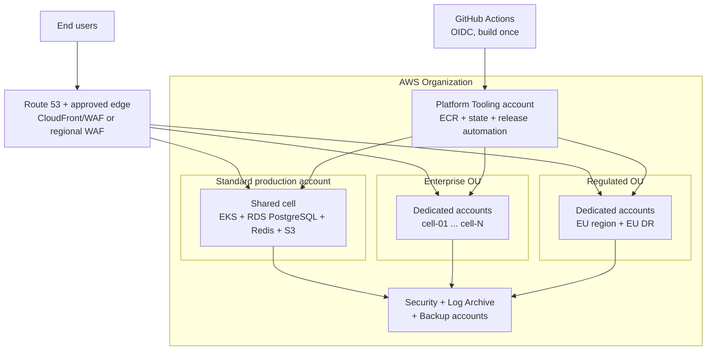
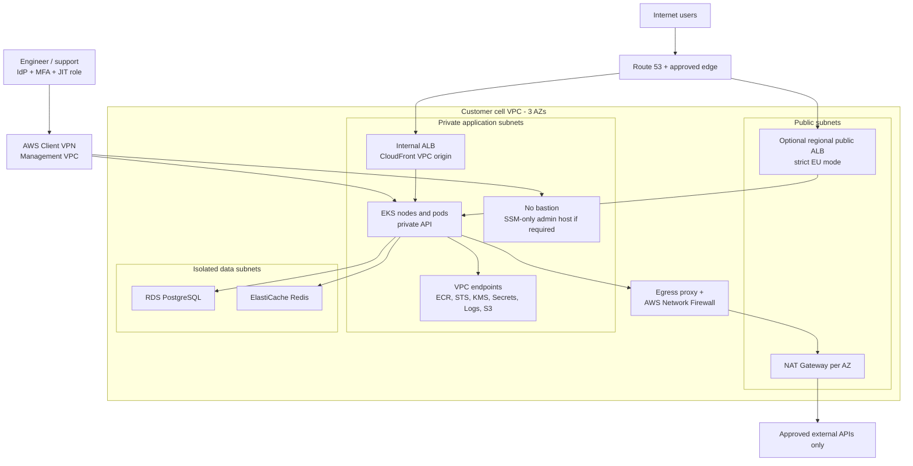

# Acme Platform - Production Architecture & Security Proposal

| Document metadata | Value |
|---|---|
| Scope | Part A - Architecture & Security Design |
| Primary region | AWS `eu-central-1` |
| Workload | B2B SaaS, approximately 10 Node.js/NestJS microservices |
| Commercial models | Standard, Enterprise, Regulated |
| Status | Proposed target architecture |

## 1. Executive summary

Acme Platform should use a **cell-based, multi-account AWS architecture**. The Standard tier runs in a shared multi-tenant production cell, while every Enterprise and Regulated customer receives a dedicated AWS account, VPC, EKS cluster, PostgreSQL database, Redis deployment, object bucket, encryption keys, and observability boundary. AWS Organizations and Control Tower provide the landing zone; a versioned Terraform "cell factory" prevents 20+ dedicated cells from becoming 20+ snowflakes.

The primary runtime is Amazon EKS on EC2 managed node groups across three Availability Zones. Only the web/API entry point is public. Kubernetes APIs, nodes, databases, caches, administration endpoints, and service-to-service traffic remain private. Engineers authenticate through the corporate identity provider, MFA, IAM Identity Center, and AWS Client VPN. Customer support receives approved, time-limited access to one cell only. There is no public SSH and no permanent bastion.

GitHub Actions builds each immutable image once, scans it, emits an SBOM, signs it, and pushes it to Amazon ECR by digest. GitHub authenticates to AWS through OIDC rather than stored AWS keys. Promotion changes a signed release manifest; an in-cluster GitOps controller pulls the approved Helm release. This avoids opening private Kubernetes APIs to GitHub-hosted runners and provides the same controlled release process across the shared tier and 20+ dedicated cells.

Security controls are designed as operating controls, not only infrastructure settings: least privilege, per-workload identities, default-deny network policy, centralized immutable audit logs, continuous vulnerability and configuration monitoring, tested backups, and evidence packages for SOC 2 CC6, CC7, CC8, and A1. GDPR is addressed through EU residency, data minimization, encryption, retention schedules, deletion workflows, subprocessor governance, and documented restore/deletion procedures.

### Key decisions

- **Isolation unit:** AWS account + VPC + EKS + data plane for each dedicated cell.
- **Fleet model:** a declarative `cell-catalog.yaml`, reusable Terraform modules, pinned Helm charts, and no per-customer forks.
- **Public path:** Route 53 -> CloudFront/WAF -> CloudFront VPC Origin -> internal ALB -> private EKS workloads. Strict EU-residency cells use a regional WAF/public ALB instead of CloudFront.
- **Administrative path:** IdP/MFA -> IAM Identity Center -> Client VPN -> private EKS API or SSM.
- **Delivery path:** GitHub Actions OIDC -> ECR and release repository -> pull-based GitOps.
- **Data protection:** per-cell customer-managed KMS keys; BYOK/XKS option for Regulated.
- **Regional DR targets:** Standard RPO 1 hour/RTO 8 hours; Enterprise 15 minutes/4 hours; Regulated PostgreSQL/queue RPO 1 minute, S3 RPO 15 minutes, and service RTO 1 hour.

### Identity and isolation identifiers

The design uses three identifiers with different trust and lifecycle rules:

- `customer_id` is the commercial/CRM identifier. It is not accepted by
  workload APIs and is not used as a database authorization boundary.
- `tenant_id` is an opaque, immutable UUID issued by the tenant registry. It is
  the application data-isolation key in the shared Standard cell.
- `cell_id` is a non-identifying infrastructure identifier mapped to one AWS
  account/VPC/cluster. It selects an Enterprise or Regulated deployment but
  does not by itself authorize access to application data.

For a dedicated single-tenant cell, configuration pins exactly one allowed
`tenant_id` to the `cell_id`. If a contract permits several customer
organizations inside one dedicated cell, those organizations still receive
distinct `tenant_id` values and the same application-level isolation controls.

## 2. Overall architecture

The organization contains separate Security, Log Archive, Backup, Platform Tooling, Standard production, and customer-cell organizational units/accounts. Organization-level CloudTrail, delegated security administrators, resource policies, SCPs, and backup policies prevent member-account administrators from changing central evidence or backup copies. SCPs deny unapproved actions and Regions, with explicit exceptions for required global services; they do not replace IAM/resource policies and do not restrict the management account or every service-linked role. This layered design materially limits a compromised workload account from affecting another cell or the evidence archive.

Terraform is split into versioned modules such as `account-baseline`, `vpc`, `eks`, `data`, `observability`, and a composition module named `cell`. Each cell has an independent root module and state key. Remote state is stored in a dedicated S3 bucket with versioning, SSE-KMS, Block Public Access, narrowly scoped cross-account roles, CloudTrail data events, and state locking. Production cells do not share a Terraform workspace or one large state file. Module releases are pinned so fleet upgrades can proceed in controlled waves.

The cell catalog records `cell_id`, tier, AWS account, primary/DR Region, release channel, maintenance window, key mode, data-retention policy, and declared RTO/RPO. A fleet conformance job compares all cells with the approved baseline and opens a ticket for drift or an expired exception.

## 3. A1 - Deployment models by tier

The RTO/RPO values below are **regional disaster objectives** measured from incident declaration. Multi-AZ failover for a node, AZ, RDS writer, or Redis primary is expected to complete much faster and is monitored separately.

| Tier | Shared versus isolated | Ingress | Backup and DR | Target RPO / RTO | Relative cost and complexity |
|---|---|---|---|---|---|
| **Standard** | Shared AWS account, VPC, EKS cluster, RDS PostgreSQL cluster, Redis, and platform components. Tenant isolation is enforced in application authorization, fail-closed PostgreSQL row-level security, tenant-scoped S3 access, and negative isolation tests. | Shared CloudFront/WAF with a private VPC origin/internal ALB; host/path routes to the shared API gateway. | Local RDS PITR plus cross-Region automated backup replication of snapshots/transaction logs; S3 versioning and S3 RTC for critical objects; Redis rebuilt from authoritative stores. Restore test twice yearly. | **1 hour / 8 hours** for PostgreSQL, critical S3 objects, and durable jobs | Baseline `1x`; highest utilization efficiency, but strongest application-level tenancy burden. |
| **Enterprise** | Dedicated AWS account, VPC, EKS cluster, RDS, Redis, S3 buckets, KMS keys, quotas, logs, and IAM roles per customer. Only source code, ECR images, and central security services are shared. | Dedicated hostname such as `cell-01.platform.example.com`, dedicated edge policy and internal ALB. Private/customer-connected ingress is optional. | PITR and immutable cross-account backup; monitored RDS cross-Region backup replication, or a cross-Region replica/Aurora Global Database when the contractual RPO requires it; S3 RTC; Redis snapshot optional. Quarterly restore test. | **15 minutes / 4 hours** for PostgreSQL, critical S3 objects, and durable jobs | Approximately `3-5x`; strong blast-radius reduction with automated fleet operations required. |
| **Regulated** | Enterprise isolation plus approved-Region guardrails, regional telemetry boundary, per-data-class CMEKs, BYOK/XKS option, stricter support access, and dedicated DR resources. Customer payloads remain in contracted EU Regions; unavoidable global-service metadata is documented separately. | Dedicated regional public ingress or private Direct Connect/VPN. CloudFront is used only when the residency contract permits global edge processing. WAF policy is customer-specific. | Warm EU DR cell; Aurora PostgreSQL Global Database with monitored RPO; S3 CRR with S3 RTC and replica KMS key; replicated durable queues/event journal; immutable cross-account Backup Vault; scheduled failover drills. | **PostgreSQL/jobs: 1 minute; S3: 15 minutes; service RTO: 1 hour** | Approximately `5-8x`; DR capacity, key custody, residency evidence, and customer change windows add cost. |

### Standard

Standard is a shared infrastructure model, not a weakly isolated model. After
authentication and tenant selection, the authorization service verifies the
subject's current membership and issues a short-lived signed token containing
the immutable `tenant_id`, subject, roles/scopes, audience, issuer, and expiry.
Ingress removes any caller-supplied tenant headers. Every service verifies the
token and authorizes the requested resource; a bare `tenant_id` is context, not
proof of authorization.

The same signed tenant context, or a narrower service token derived from it, is
bound to WebSocket subscriptions and placed in authenticated SQS/event/job
metadata. Workers reject payload-supplied tenant identifiers that do not match
the verified message context. Audit records retain the original subject,
effective tenant, acting service, and support impersonation/JIT authorization.

Every tenant-owned PostgreSQL table has a non-null `tenant_id`; unique and
foreign-key constraints include it so a relationship cannot cross tenants.
RLS is enabled and forced, with both `USING` and `WITH CHECK` policies. The
application role is neither table owner, superuser, nor `BYPASSRLS`. At
transaction start the data-access layer calls
`set_config('app.tenant_id', value, true)` (`SET LOCAL` semantics), fails closed
when the setting is absent, and returns the pooled connection only after
commit/rollback. Migration/support roles are separate and audited. RLS is
defence in depth; centralized application authorization and cross-tenant
negative tests remain mandatory.

S3 access is mediated by a tenant-scoped role/access point and object-key
conditions derived from the verified context; clients receive short-lived
presigned URLs, never bucket credentials. Redis contains no system of record.
Service ACLs and tenant-prefixed keys reduce accidental collisions, but a key
prefix is not treated as a hard security boundary.

### Enterprise

The dedicated AWS account is the primary security boundary. It avoids complex cross-tenant security-group, IAM, KMS, database, and quota interactions. The cell is created from the same versioned modules and Helm charts as Standard. Customer-specific behavior is data and configuration in the cell catalog, not a code or Terraform fork. Dedicated cells may be stopped or right-sized independently and can receive a contractual maintenance window.

### Regulated

Regulated uses the Enterprise model with residency and cryptographic custody controls. Region-deny SCPs include reviewed exceptions for global services such as IAM, Route 53, Organizations, and support; data residency is additionally enforced by service allowlists, resource policies, endpoint policies, approved destination Regions, and continuous Config/evidence checks. Strict EU mode bypasses CloudFront and uses a regional WAF/public ALB or private customer connectivity so request payloads stay in the contracted Regions. Global control-plane identifiers and DNS metadata are documented in the data-flow register rather than incorrectly described as regional payload storage. Backups, support session logs, traces, and dead-letter payloads follow the contracted residency rule. If the contract requires customer-controlled revocation, Acme supports imported KMS key material or an AWS KMS External Key Store; the customer must accept that an unavailable/revoked external key can make the service and restore process unavailable.

## 4. A2 - Network and access model

### VPC and subnet design

Each cell has one VPC spanning three Availability Zones:

- AWS VPC IPAM allocates a unique, non-overlapping CIDR to every cell and
  records it in the cell catalog before provisioning. Customer VPN/Direct
  Connect CIDRs are checked for overlap; unavoidable overlap uses an approved
  translation/proxy boundary rather than ambiguous Transit Gateway routes.
- **Public subnets** contain NAT Gateways, firewall routing attachments, and only those internet-facing ALBs required for strict regional ingress. EC2 nodes never receive public IP addresses.
- **Private application subnets** contain EKS nodes/pods, the default internal ALB used as a CloudFront VPC origin, VPC endpoints, and an optional minimal SSM-managed diagnostic host.
- **Isolated data subnets** contain RDS and ElastiCache. They have no default route to an Internet Gateway or NAT Gateway.
- Interface endpoints are created for ECR API/Docker, STS, Secrets Manager, KMS, CloudWatch Logs, SSM, `ssmmessages`, and `ec2messages`; an S3 gateway endpoint keeps object and image traffic off the public internet.
- Security groups reference other security groups rather than broad CIDRs: ALB -> ingress pods, application pods -> database/Redis, and approved administration networks -> private EKS endpoint.

End users can reach only the approved HTTPS edge. The default CloudFront design uses a VPC origin so the internal ALB cannot be called directly. A strict regional public ALB is protected by regional AWS WAF, exposes only port 443, and is not combined with an unprotected alternate origin hostname. AWS WAF applies managed baseline rules, rate limits, bot controls where justified, and customer-specific IP restrictions. TLS 1.2+ terminates using ACM at the edge/ALB, then traffic is re-encrypted to the ingress target. WebSocket idle timeouts, connection draining, and pod disruption budgets are configured explicitly.

The EKS public API endpoint is disabled. Platform engineers connect through a federated AWS Client VPN in the management VPC and Transit Gateway routing to the selected cell. Authorization still requires an EKS access entry and Kubernetes RBAC. There is no inbound SSH. If packet-level diagnostics are necessary, an EC2 admin host in a private subnet is accessed only through SSM Session Manager; its instance profile is minimal and sessions are recorded to encrypted CloudWatch Logs/S3.

Customer support uses a JIT role in exactly one cell account. The request includes a ticket, customer/cell identifier, reason, duration, and approver. Session tags and IAM conditions bind the role to that account; Kubernetes RBAC limits it to the customer application namespace and read-only actions by default. There is no transitive routing between cell VPCs.

### Egress control policy

The default is **deny**. An external dependency is allowed only when the dependency registry records an owner, purpose, domains, ports, data classification, DPA/subprocessor status, timeout/retry policy, and expiry/review date.

Enforcement is layered:

1. Kubernetes default-deny egress policies permit DNS, VPC endpoints, internal services, and the egress proxy only.
2. HTTP(S) traffic leaves through an egress gateway/proxy that validates the destination hostname and TLS certificate.
3. AWS Network Firewall allows approved domain/SNI and port combinations before traffic reaches the NAT Gateway. Route 53 Resolver DNS Firewall blocks unapproved/malicious domains; direct external DNS, DNS-over-HTTPS endpoints, and UDP/443 (QUIC bypass) are blocked unless explicitly approved.
4. Payments, model APIs, and email receive separate policy groups and CloudWatch metrics. Non-HTTP protocols require a security review and explicit destination rule.
5. Firewall, proxy, DNS, VPC Flow, and NAT logs are centralized. A denied destination generates a ticket; repeated or suspicious denials generate a security alert.

This control has an operational trade-off: vendors with changing domains may break until their allowlist is updated. Dependency changes therefore use a tested PR, staged rollout, owner approval, and an emergency time-bounded exception rather than a permanent `0.0.0.0/0` rule.

## 5. A3 - Identity, secrets, and encryption keys

### Humans

- Workforce access is federated from the corporate IdP into AWS IAM Identity Center with phishing-resistant MFA. Routine users do not have IAM users or access keys.
- Permission sets separate viewer, operator, security-auditor, and infrastructure-deployer duties. Production write roles are JIT and normally limited to one hour.
- EKS access uses EKS access entries mapped to named Kubernetes groups. No routine principal receives `system:masters`.
- Quarterly access reviews compare HR roster, group membership, AWS assignments, GitHub teams, and Kubernetes bindings. Termination disables the IdP identity and active sessions immediately.

### CI/CD

GitHub Actions requests a short-lived token from `token.actions.githubusercontent.com` and assumes a dedicated AWS role. Trust policies require `aud=sts.amazonaws.com`. The build role accepts only `sub=repo:ORG/REPO:ref:refs/heads/main`; a production job that references a GitHub Environment uses the distinct `sub=repo:ORG/REPO:environment:ENVIRONMENT` form. Because that environment subject does not contain the branch, the GitHub Environment deployment policy separately allows only `main` and requires reviewers. Build/ECR push, Terraform plan, Terraform apply, and release-promotion roles are separate. Protected branches and CODEOWNERS add review around workflow changes. No AWS access key is stored in GitHub.

The build role can push only to approved ECR repositories. The promotion job can update only the release manifest; it has no direct Kubernetes or application-secret access because Argo CD performs pull-based deployment. Terraform apply roles use permission boundaries and are limited to the target account. The workflow sets a traceable role session name containing the run ID, and the evidence manifest maps that run to the repository, commit, approvals, artifacts, and target account; CloudTrail does not infer the commit automatically.

### Workloads and secrets

- Each Kubernetes service account receives one IAM role through EKS Pod Identity/IRSA; node roles contain only node bootstrap, logging, and image-pull permissions.
- AWS Secrets Manager is the source of truth. External Secrets Operator retrieves only explicitly named secrets using the workload identity. Sensitive values are mounted as read-only files when the application supports reload; no secret is committed to Git, Helm values, Terraform variables, or container images.
- Kubernetes secret envelope encryption uses a cell KMS key. Secrets Manager rotates database credentials with an alternating-user strategy; application DB credentials rotate at least every 30 days, third-party tokens at least every 90 days or the vendor maximum, and any exposed credential immediately.
- Applications tolerate overlapping secret versions, re-establish pools, and expose a rotation-success metric. Rotation failure pages the service owner.

### KMS and BYOK

Each cell has separate customer-managed KMS keys for application data, secrets, backups, and logs. Key policies name service roles and central backup/security roles; wildcard principals are prohibited. AWS-generated key material uses automatic rotation. RDS, EBS, S3, ElastiCache, Secrets Manager, EKS secrets, CloudWatch Logs, ECR, and backup vaults use the appropriate key.

Regulated supports:

- **CMEK:** Acme-managed, cell-specific KMS keys with customer-visible policy/evidence.
- **BYOK:** customer key material imported into an Acme KMS key, with a documented joint rotation ceremony.
- **XKS:** optional external key custody when contractual revocation outside AWS is required; availability and latency are part of the SLA design.

Keys in the DR Region are distinct and policy-controlled. Rotation of a storage encryption key that cannot be changed in place uses a new encrypted resource plus snapshot/replication and controlled cutover. Key deletion requires two-person approval and the maximum practical waiting period.

### Break-glass

Break-glass uses two named emergency IAM principals that do not have access keys, each protected by separately held hardware MFA and permitted only to assume a disabled-by-default emergency role. Credentials/recovery material are stored through an offline dual-control process outside the normal SSO dependency. Activation requires an incident/ticket, incident commander plus security approver, named cell, minimal policy, and expiry. CloudTrail, SSM, shell/session, and Kubernetes audit logs are streamed to the Log Archive account. The path is tested quarterly without accessing customer content. Security reviews every activation within one business day, revokes sessions, rotates any accessed secrets, and records follow-up actions.

## 6. A4 - Kubernetes and runtime platform

| Area | Standard | Enterprise | Regulated |
|---|---|---|---|
| Cluster/account | One shared production EKS cluster/account | One EKS cluster/account per customer cell | One EKS cluster/account per customer and approved Region; DR cluster pre-provisioned |
| Compute | EC2 managed node groups; On-Demand API pool and Spot-capable async pool | Same topology, independently sized | On-Demand minimum capacity; tighter instance/SCP allowlist |
| Namespaces | `platform-system`, `observability`, and application/domain namespaces | Same; one customer workload boundary | Same plus stricter policy and support bindings |
| Network | Default deny; API gateway is the only ingress to domain services | Same, with cell-local endpoints | Same plus mandatory egress allowlist and optional service mTLS |

Platform components are installed from pinned Helm releases:

- AWS Load Balancer Controller with an internal ALB for the default CloudFront
  VPC origin; a regional public ALB/ACM is created only for the approved strict
  regional-ingress mode.
- `cert-manager` for internal service/webhook certificates; public edge certificates stay in ACM so private keys do not enter the cluster.
- External Secrets Operator for Secrets Manager.
- Kyverno for admission policies and signed-image verification.
- Argo CD and Argo Rollouts for pull-based Helm reconciliation and progressive delivery.
- Karpenter/HPA for scaling, metrics-server, OpenTelemetry Collector, Fluent Bit, Prometheus exporters, and node/problem detectors.

Baseline controls:

- Pod Security Admission `restricted`; non-root UID, read-only root filesystem, seccomp `RuntimeDefault`, dropped Linux capabilities, no privilege escalation, no host network/PID/IPC, and no unapproved `hostPath`.
- Required CPU/memory requests and limits, liveness/readiness/startup probes, topology spread, disruption budgets, and graceful termination.
- Default-deny ingress and egress NetworkPolicies. Domain services accept traffic only from the API gateway or explicitly declared peer. Database security groups accept a dedicated pod security group attached through EKS Security Groups for Pods (`SecurityGroupPolicy`), with VPC CNI enforcement mode tested alongside NetworkPolicy; using the shared node security group would allow every pod on that node to reach the database.
- Images are pinned by digest and come from approved ECR repositories. CI runs dependency, secret, IaC, Helm, and Trivy scans; ECR enhanced scanning provides continuous findings. Critical findings block release unless an expiring, approved risk exception exists.
- Build produces an SBOM and keyless/signing evidence. Admission rejects unsigned images, `latest` tags, privileged pods, and unapproved registries.
- EKS control-plane audit/authenticator/API logs, container runtime findings, Kubernetes events, and policy reports are exported centrally.
- Separate On-Demand API nodes and interruptible async/export nodes use taints/tolerations. Jobs are idempotent, checkpoint results to PostgreSQL/S3, and use SQS where application changes permit; Redis is not treated as durable job storage.

## 7. A5 - Data layer

| Store | Standard | Enterprise / Regulated | Security and recovery controls |
|---|---|---|---|
| PostgreSQL | Shared Amazon RDS/Aurora PostgreSQL Multi-AZ; non-null `tenant_id`, tenant-aware constraints, forced RLS, and transaction-local connection context | Dedicated RDS PostgreSQL Multi-AZ per cell; Regulated adds EU Aurora Global Database with measured RPO where required | TLS required, KMS encryption, no public endpoint, application role cannot own tables or bypass RLS, PITR, cross-Region recovery, audit logs, restore validation |
| Redis | Shared ElastiCache Redis deployment; service ACLs and tenant-prefixed cache keys | Dedicated replication group per cell | TLS in transit, KMS at rest, RBAC/auth, Multi-AZ auto-failover; no authoritative records; snapshot only for faster recovery |
| Object storage | S3 with tenant prefixes/access points and IAM condition keys | Dedicated buckets and keys per cell; Regulated CRR only to approved EU Region | Block Public Access, bucket-owner enforced, SSE-KMS, versioning, lifecycle, access logs/data events; Object Lock for evidence/backups |

Durable async work uses SQS queues and DLQs, not Redis. Each message envelope
contains an immutable job ID, verified tenant context, schema version,
idempotency key, and pointer to encrypted S3 payload rather than a large or
sensitive inline body. Queue policies and KMS keys are cell-scoped. Standard
and Enterprise regional recovery replays the durable job journal from
PostgreSQL/S3 within their tier RPO; Regulated additionally replicates the
journal to the warm EU DR cell and continuously tests duplicate-safe replay.

Database migrations follow **expand-contract**:

1. A backward-compatible schema expansion is applied by a dedicated migration job with a lock-time budget and one active migrator.
2. Applications supporting old and new schema versions roll out progressively.
3. Data is backfilled with checkpoints and observable progress.
4. Reads switch, then writes switch.
5. Destructive cleanup occurs in a later release after the rollback window.

To move a Standard tenant to a dedicated cell, Acme provisions the target from code, applies the same schema, performs a tenant-filtered initial copy, and uses AWS DMS or PostgreSQL logical replication with tested row filters for change data capture where practical. Replication roles are deliberately privileged and therefore isolated, time-limited, and audited. The cutover includes a short tenant write freeze, row counts/checksums, referential-integrity and object-copy verification, routing change, smoke tests, and a documented rollback window. Redis is warmed rather than migrated.

After customer acceptance and expiry of the rollback window, the source
tenant's active rows, objects, cache keys, pending jobs, indexes, and search
copies are logically purged and recorded in a deletion ledger. Standard uses
shared storage keys, so per-tenant cryptographic erasure is not claimed:
residual copies expire through the documented backup lifecycle and are
re-deleted if restored. Cryptographic erasure is available only for a
dedicated cell/key after legal hold and all required retention periods end.

AWS Backup policies tag and select all cell resources. Backup vaults live in a dedicated Backup account, separate from the Log Archive account, so a cell administrator cannot delete recovery points or evidence. Regulated copies are immutable and cross-Region within the permitted geography. Replication lag/latest-restorable-time alarms are evaluated against each store's declared RPO. A restore is not considered successful until application-level checks verify schema version, representative objects, authentication, queued-job replay/idempotency, and observed recovery time/data loss against the objective.

## 8. A6 - CI/CD and release strategy

### Build and promotion

1. A pull request runs unit/integration tests, `npm audit`, secret and license checks, Terraform/Helm validation, policy tests, and Trivy. Required reviewers and CODEOWNERS protect infrastructure, policy, and workflow files.
2. Merge to `main` builds one minimal, non-root Docker image. The pipeline generates an SBOM, signs provenance, pushes to ECR, and records the immutable digest.
3. The same digest is deployed to development, staging, Standard canary, Enterprise pilot cells, Enterprise waves, and Regulated cells. Images are never rebuilt per customer.
4. Promotion is a reviewed change to a release manifest containing image digests, Helm chart version, config version, migration version, and release channel.
5. In-cluster Argo CD pulls the manifest and Helm chart. This permits a private EKS API and avoids a long-lived central cluster credential.

Release waves are `standard-canary -> standard-100% -> enterprise-pilot -> enterprise-25% -> enterprise-100% -> regulated-window`. Regulated promotion requires manual approval and a customer maintenance window where contracted. Fleet concurrency limits prevent one faulty release from saturating all accounts or support teams.

Argo Rollouts advances Standard traffic through 5%, 25%, 50%, and 100%. A dedicated cell uses a small canary ReplicaSet or safe rolling deployment, while the fleet itself is the larger progressive-delivery boundary. Automated gates cover HTTP 5xx, p95 latency, WebSocket disconnects, async-job failures/age, saturation, and a business transaction smoke test.

Rollback points to the last known-good image/chart digest and reconciles it. Database expand-contract rules keep N-1 application compatibility. A migration that cannot be rolled back is a separate, explicitly approved release with a restore or forward-fix plan. Terraform changes use plan on PR and apply only the reviewed commit after environment approval; high-risk data/network changes use a maintenance window.

### Disaster-recovery drill

1. Select a representative cell and scenario; record approved objectives and observers.
2. Declare the simulated incident and stop writes or establish a recovery point.
3. Provision/validate the DR cell from pinned Terraform and Helm versions without copying live credentials.
4. Promote the replicated database or restore the latest backup; restore/validate S3 and regenerate Redis.
5. Change Route 53 health/weighted records, run security and functional smoke tests, and confirm observability.
6. Measure actual RPO/RTO, data reconciliation, alert delivery, support communications, and rollback.
7. Fail back or destroy the isolated drill environment, store evidence, and track corrective actions to closure.

Regulated cells drill at least quarterly, Enterprise twice yearly, and Standard annually. A failed objective creates a high-priority remediation item and a repeated drill.

## 9. A7 - Observability and SOC 2 evidence

Node.js services use OpenTelemetry for consistent trace IDs, tenant-safe correlation IDs, RED metrics, and structured JSON logs. An OpenTelemetry Collector gateway receives traces/metrics; Prometheus scrapes Kubernetes and service metrics and remote-writes to a central managed or isolated metrics store. Grafana presents fleet, cell, SLO, release, database, queue/job, and security dashboards. Fluent Bit sends application/platform logs to CloudWatch Logs and an encrypted S3 archive. Traces go to an OTLP-compatible backend such as AWS X-Ray or Tempo.

Logs must not contain source documents, access tokens, raw prompts, object contents, or unnecessary personal data. A logging SDK redacts configured fields before emission and prevents untrusted correlation identifiers from becoming executable log fields. `cell_id`, service, version, request ID, and keyed/pseudonymous tenant or user identifiers remain available for investigation. Pseudonymised identifiers are still treated as GDPR personal data when re-identification is possible, so they retain access, purpose, residency, retention, and deletion controls. Access to a customer's payload-bearing logs stays in its cell; central dashboards receive operational metadata only for Regulated residency.

Alerting is symptom/SLO based. Multi-window burn-rate alerts page for rapid availability-budget consumption; ticket-level alerts cover slower degradation, capacity, backup/rotation failure, expiring certificates, drift, vulnerabilities, and policy exceptions. Alerts include a runbook, dashboard, cell, owner, and last deployment. Every page creates an incident record, timeline, communication log, and post-incident action list.

Security telemetry includes organization CloudTrail, AWS Config, GuardDuty, Security Hub, Inspector/ECR findings, IAM Access Analyzer, WAF/ALB logs, VPC Flow Logs, Route 53 DNS Firewall, Network Firewall, SSM sessions, EKS audit logs, Kyverno policy reports, and backup jobs. Security/audit evidence is kept online for at least 13 months and archived according to the approved legal schedule; customer/personal data follows the shorter contractual/GDPR retention rule. Evidence objects use SSE-KMS, versioning, Object Lock, and a Log Archive account.

### SOC 2 control mapping

| Criteria | Implemented technical/operating controls | Example audit evidence |
|---|---|---|
| **CC6 - Logical and physical access** | IdP + MFA + IAM Identity Center; JIT and cell-scoped roles; EKS RBAC; workload identities; Secrets Manager rotation; KMS policies; default-deny network controls; quarterly access review; break-glass process | IdP/MFA policy, permission-set export, approved access tickets, access-review sign-off, CloudTrail role sessions, RBAC/NetworkPolicy reports, rotation history, KMS grants, break-glass session review |
| **CC7 - System operations and security monitoring** | Central logs/metrics/traces; SLO and security alerts; GuardDuty/Security Hub/Inspector; vulnerability SLAs; incident response; egress monitoring; drift detection; daily backup monitoring | Alert history, on-call/incident tickets, postmortems, scan and patch reports, GuardDuty triage, firewall denials, backup failures, monthly log-review evidence, remediation closure |
| **CC8 - Change management** | Protected branches, CODEOWNERS, peer review, tested/signed artifacts, OIDC, immutable digests, environment approvals, Terraform plans, progressive delivery, rollback, emergency-change review | PR approvals, CI results, SBOM/provenance/signature, Terraform plan/apply logs, release manifest, Argo sync/rollout events, approval record, emergency-change retrospective |
| **A1 - Availability** | Multi-AZ architecture; autoscaling/capacity alerts; declared SLO/RTO/RPO; PITR and immutable backups; cross-Region DR; tested restore/failover; dependency resilience | SLO reports, capacity/load tests, backup inventory, restore/failover drill report, measured RPO/RTO, corrective actions, service review minutes |

An automated monthly evidence job exports configuration snapshots and API reports, writes a manifest containing hashes and collection time, and stores the package in the immutable evidence bucket. Compliance owns the control/evidence matrix; Engineering owns the source controls. Auditors receive time-limited, read-only access to the evidence set rather than broad production access.

## 10. A8 - Enterprise customer onboarding and offboarding

1. **Contract and design intake:** record controller/processor responsibilities, tier, data categories, DPA/subprocessors and transfer mechanism, DPIA/record-of-processing requirements, residency, data-subject-request and breach-notification workflow, SLA/RTO/RPO, retention/deletion, SSO/SCIM, domain/network requirements, BYOK model, maintenance window, and support-access rules.
2. **Cell registration:** generate a non-identifying `cell_id`; add an approved entry to the cell catalog. Security and Finance review exceptions, Region, budget, and service quotas.
3. **Provision:** Account Factory creates the AWS account; Terraform deploys baseline guardrails, VPC/endpoints/firewall, EKS, RDS, Redis, S3, KMS, observability, backups, and budget alerts. State is independent and outputs are registered without secret values.
4. **DNS/TLS/connectivity:** create Route 53 and ACM resources for `cell-01.platform.example.com`, or validate a customer CNAME/private connection. Test TLS, WAF, IP restrictions, VPN/Direct Connect, and egress allowlists.
5. **Deploy and configure:** GitOps installs pinned platform components and the approved application release. Secrets Manager receives generated credentials through secure automation. SSO metadata and tenant configuration are applied without entering Terraform state.
6. **Validate:** run functional smoke tests, synthetic business transaction, WebSocket and async-job checks, negative network/isolation tests, policy scan, vulnerability scan, backup job, test restore, log/alert delivery, and a small load baseline. Store the signed acceptance report.
7. **Handoff:** assign service owner/on-call, dashboards, runbooks, escalation contacts, maintenance window, known limits, support permissions, cost allocation tags, and customer-facing status/incident procedures.
8. **Operate:** track release channel, drift, capacity, access reviews, key/secret rotation, vulnerability SLAs, backup/restore evidence, and customer-approved exceptions.
9. **Offboard:** authenticate and approve the request; stop new writes; provide the contracted export; revoke SSO/API/support access and rotate shared integrations; apply legal hold/retention; delete active PostgreSQL, Redis, S3, queue/DLQ, search, and telemetry data; quarantine the account; remove DNS; and retain only legally required pseudonymous audit evidence. A dedicated KMS key is scheduled for deletion only after every dependent backup/evidence retention period and legal hold has ended and a dependency inventory proves it is no longer required. A second person verifies the deletion inventory before account closure and issuance of the deletion certificate.

## 11. Top five risks and trade-offs

| Risk / trade-off | Impact | Mitigation and residual risk |
|---|---|---|
| **Shared-tier tenant isolation defect** | Cross-tenant disclosure is the highest confidentiality risk. | RLS, mandatory tenant context, centralized authorization library, S3 access-point conditions, automated cross-tenant negative tests, and security review. Residual application risk remains; high-sensitivity customers use a dedicated cell. |
| **Dedicated-cell sprawl and drift** | 20+ accounts/clusters can become inconsistent, expensive, and slow to patch. | Cell catalog, versioned modules/charts, no forks, automated conformance, fleet dashboards, release waves, expiry on exceptions, and periodic account cleanup. Isolation is intentionally purchased with platform-engineering overhead. |
| **Fleet-wide release/control-plane blast radius** | A bad image, chart, or privileged pipeline could affect many customers. | Build once, signed digest, pull-based per-cell reconciliation, least-privilege OIDC roles, canary plus cell waves, concurrency limits, and tested rollback. Shared source and ECR remain controlled concentration points. |
| **Regional or external dependency outage** | Payments/model/email failures may block workflows; regional loss can breach SLA. | Queues, timeouts, circuit breakers, idempotency, backpressure, provider-specific runbooks, EU DR, restore drills, and explicit degraded modes. Lower RTO/RPO requires paid warm capacity. |
| **BYOK/XKS custody and availability** | Expired, revoked, or unavailable customer keys can prevent reads, writes, backups, or recovery. | Preflight health checks, dual-control rotation, DR key testing, cached data-key design only where acceptable, contractual responsibilities, and break-glass communication. External custody deliberately exchanges Acme control for customer control. |

## 12. Implementation roadmap

| Phase | Target outcome | Exit criteria |
|---|---|---|
| **0. Architecture decisions (weeks 0-2)** | Confirm tier contracts, data classification, SLO/RTO/RPO, Regions, tenancy enforcement, BYOK modes, and threat model. | Approved ADRs, control owners, data-flow inventory, cost model, and risk register. |
| **1. Landing zone and supply chain (weeks 2-6)** | Organizations/Control Tower accounts, SCPs, Identity Center, central logs/security, GitHub OIDC, ECR scanning/signing, and hardened Terraform state. | No long-lived CI keys; org trail/config/GuardDuty active; evidence bucket immutable; golden pipeline passes. |
| **2. Standard production cell (weeks 5-11)** | Three-AZ VPC/EKS/data platform, ingress/egress, runtime policies, observability, backups, and Standard canary release. | Private EKS API, negative isolation tests, production SLOs, successful restore, security review, and operational runbooks. |
| **3. Cell factory and Enterprise pilot (weeks 9-15)** | Parameterized account/cell module, catalog, GitOps bootstrap, fleet rollout, dedicated DNS/TLS, onboarding automation. | `cell-01` created without manual console work; repeatable second cell; drift and cost dashboards; support JIT tested. |
| **4. Regulated and DR (weeks 14-22)** | Region deny policies, CMEK/BYOK, regional telemetry boundary, warm DR, cross-Region data replication, deletion evidence. | Measured RPO/RTO drill passes; customer key rotation tested; GDPR/SOC 2 evidence reviewed; auditor-ready package. |
| **5. Continuous operations** | Monthly patch/release cadence, quarterly access/evidence review, vulnerability SLAs, capacity planning, game days, and cost optimization. | Control metrics reviewed by owners; exceptions expire; failed tests/drills have tracked corrective actions. |

The first dedicated cell is intentionally not considered complete until the **second** cell can be provisioned from the same inputs. That proves the design is an operational platform rather than a one-off environment.

## 13. Design references

- [Amazon EKS cluster API endpoint access](https://docs.aws.amazon.com/eks/latest/userguide/cluster-endpoint.html)
- [Amazon EKS Security Groups for Pods](https://docs.aws.amazon.com/eks/latest/userguide/security-groups-for-pods.html)
- [AWS IAM OIDC federation](https://docs.aws.amazon.com/IAM/latest/UserGuide/id_roles_providers_oidc.html)
- [GitHub Actions OIDC with AWS](https://docs.github.com/actions/deployment/security-hardening-your-deployments/configuring-openid-connect-in-amazon-web-services)
- [GitHub Actions OIDC subject claim formats](https://docs.github.com/actions/reference/openid-connect-reference)
- [AWS SaaS Lens - tenant identity and context](https://docs.aws.amazon.com/wellarchitected/latest/saas-lens/identity-and-access-management.html)
- [PostgreSQL row security policies](https://www.postgresql.org/docs/current/ddl-rowsecurity.html)
- [CloudFront VPC origins](https://docs.aws.amazon.com/AmazonCloudFront/latest/DeveloperGuide/private-content-vpc-origins.html)
- [Amazon RDS cross-Region automated backups](https://docs.aws.amazon.com/AmazonRDS/latest/UserGuide/USER_ReplicateBackups.html)
- [Aurora Global Database disaster recovery](https://docs.aws.amazon.com/AmazonRDS/latest/AuroraUserGuide/aurora-global-database-disaster-recovery.html)
- [Amazon S3 Replication Time Control](https://docs.aws.amazon.com/AmazonS3/latest/userguide/replication-time-control.html)
- [AWS Secrets Manager rotation](https://docs.aws.amazon.com/secretsmanager/latest/userguide/rotating-secrets.html)
- [Amazon S3 Object Lock](https://docs.aws.amazon.com/AmazonS3/latest/userguide/object-lock.html)
- [European Commission - pseudonymised data and GDPR](https://commission.europa.eu/law/law-topic/data-protection/data-protection-explained_en)
- [GDPR, Regulation (EU) 2016/679](https://eur-lex.europa.eu/eli/reg/2016/679/oj/eng)
